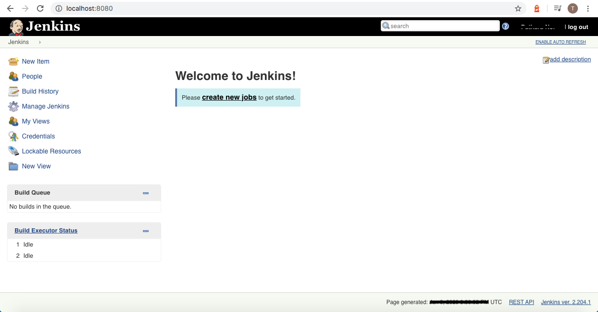

# Jenkins + Docker Compose
[]()
[]()
[](https://www.paypal.com/cgi-bin/webscr?cmd=_s-xclick&hosted_button_id=A8YE92K9QM7NA)

## Start service

The service contains 1-service (Jenkins master node) and 1-volume to contain Jenkins data.

```bash
# Start service
$ docker-compose up --build
```

## Environment

#### Port

 - **Master node** : 8080
 - **Slave node** : 50000


## Setup

Before setup the service you need to using admin password to access it, please refer to your console :

```bash
# ...

jenkins-master | 20XX-XX-XX 15:28:21.522+0000 [id=26]	INFO	o.s.c.s.AbstractApplicationContext#obtainFreshBeanFactory: Bean factory for application context [org.springframework.web.context.support.StaticWebApplicationContext@7f8876a]: org.springframework.beans.factory.support.DefaultListableBeanFactory@4bf6c155
jenkins-master | 20XX-XX-XX 15:28:21.523+0000 [id=26]	INFO	o.s.b.f.s.DefaultListableBeanFactory#preInstantiateSingletons: Pre-instantiating singletons in org.springframework.beans.factory.support.DefaultListableBeanFactory@4bf6c155: defining beans [filter,legacy]; root of factory hierarchy
jenkins-master | 20XX-XX-XX 15:28:22.538+0000 [id=26]	INFO	jenkins.install.SetupWizard#init:
jenkins-master |
jenkins-master | *************************************************************
jenkins-master | *************************************************************
jenkins-master | *************************************************************
jenkins-master |
jenkins-master | Jenkins initial setup is required. An admin user has been created and a password generated.
jenkins-master | Please use the following password to proceed to installation:
jenkins-master |
jenkins-master | a2c599e109874f10aeffe350fcce3af6
jenkins-master |
jenkins-master | This may also be found at: /var/jenkins_home/secrets/initialAdminPassword
jenkins-master |
jenkins-master | *************************************************************
jenkins-master | *************************************************************
jenkins-master | *************************************************************
jenkins-master |
jenkins-master | 20XX-XX-XX 15:28:37.766+0000 [id=41]	INFO	hudson.model.UpdateSite#updateData: Obtained the latest update center data file for UpdateSource default
jenkins-master | 20XX-XX-XX 15:28:39.803+0000 [id=26]	INFO	hudson.model.UpdateSite#updateData: Obtained the latest update center data file for UpdateSource default
jenkins-master | 20XX-XX-XX 15:28:40.188+0000 [id=26]	INFO	jenkins.InitReactorRunner$1#onAttained: Completed initialization
jenkins-master | 20XX-XX-XX 15:28:40.278+0000 [id=19]	INFO	hudson.WebAppMain$3#run: Jenkins is fully up and running
jenkins-master | 20XX-XX-XX 15:28:40.670+0000 [id=41]	INFO	h.m.DownloadService$Downloadable#load: Obtained the updated data file for hudson.tasks.Maven.MavenInstaller
jenkins-master | 20XX-XX-XX 15:28:40.672+0000 [id=41]	INFO	hudson.util.Retrier#start: Performed the action check updates server successfully at the attempt #1
jenkins-master | 20XX-XX-XX 15:28:40.684+0000 [id=41]	INFO	hudson.model.AsyncPeriodicWork#lambda$doRun$0: Finished Download metadata. 21,986 ms
```

In this case, it is `a2c599e109874f10aeffe350fcce3af6`

You can access setup page via :
```bash
http://localhost:8080
```

You can install custom/suggest plugins.

After that, enjoy!!!



## Official Jenkins Docker image

https://github.com/jenkinsci/docker/blob/master/README.md

## Testing pipeline with Jenkinsfile runner

Please refer to `./testing/`.

I have created sample pipeline to test multi-instances deployment by focusing on :

 - Import `JSON` data object from `JSON` file (`./testing/pipeline/instances.json`).
 - Looping the `JSON` data object array.

The testing service using Jenkinsfile runner to interpret `Jenkinsfile`(`./testing/Jenkinsfile`). It has already composed by Docker compose(`./testing/docker-compose.yml`). You just write your pipeline and run command below to interpret it.

```bash
$ docker-compose up --build
```

then, see the result

**note**: it independent from main service.

```bash
jenkinsfile-runner    | Started
jenkinsfile-runner    | Running in Durability level: PERFORMANCE_OPTIMIZED
jenkinsfile-runner    | [Pipeline] Start of Pipeline
jenkinsfile-runner    | [Pipeline] node
jenkinsfile-runner    | Running on Jenkins in /build
jenkinsfile-runner    | [Pipeline] {
jenkinsfile-runner    | [Pipeline] stage
jenkinsfile-runner    | [Pipeline] { (Declarative: Checkout SCM)
jenkinsfile-runner    | [Pipeline] checkout
jenkinsfile-runner    | [Pipeline] }
jenkinsfile-runner    | [Pipeline] // stage
jenkinsfile-runner    | [Pipeline] stage
jenkinsfile-runner    | [Pipeline] { (Build)
jenkinsfile-runner    | GOT CONTEXT FOR Build
jenkinsfile-runner    | [Pipeline] sh
jenkinsfile-runner    | + ls
jenkinsfile-runner    | Dockerfile
jenkinsfile-runner    | Jenkinsfile
jenkinsfile-runner    | common.groovy
jenkinsfile-runner    | instances.json
jenkinsfile-runner    | [Pipeline] readJSON
jenkinsfile-runner    | [Pipeline] echo
jenkinsfile-runner    | 111.111.111.111
jenkinsfile-runner    | [Pipeline] }
jenkinsfile-runner    | [Pipeline] // stage
jenkinsfile-runner    | [Pipeline] }
jenkinsfile-runner    | [Pipeline] // node
jenkinsfile-runner    | [Pipeline] End of Pipeline
jenkinsfile-runner    | Finished: SUCCESS
```

## License

MIT license